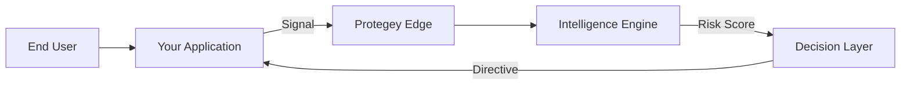

# Platform Architecture

Protegey is built on a distributed, event-driven architecture designed to process high-velocity signals while maintaining privacy and security. The platform operates as an intelligent layer between your application and potential threats.

::alert{type="info"}
The architecture diagrams below represent the high-level data flow. Implementation details are reserved for partner documentation.
::

## Core Components

### 1. The Signal Ingestion Layer
The entry point for all data. This high-throughput layer accepts signals from SDKs, APIs, and partner integrations. It performs immediate validation and normalization before routing data to the processing engine.

- **Global Edge Network**: Low-latency endpoints distributed worldwide
- **Stream Processing**: Real-time event ingestion via WebSocket and HTTP/2
- **Payload Validation**: Strict schema enforcement at the edge

### 2. The Intelligence Engine
The heart of Protegey. This engine correlates new signals with historical data and global patterns to assess risk.

- **Behavioral Analysis**: Tracks user journey patterns across sessions
- **Device Fingerprinting**: Identifies devices even after resets or IP changes
- **Network Effects**: Leverages cross-partner intelligence (without sharing raw data)

### 3. The Decision Layer
Where intelligence becomes action. Examples of decisions include `BLOCK`, `CHALLENGE`, or `ALLOW`.

- **Policy Engine**: Configurable rules specific to your business logic
- **ML Scoring**: Probabilistic risk assessment (LOW, MEDIUM, HIGH, CRITICAL)
- **Response Orchestration**: Directives sent back to your application

## Data Flow

## Hybrid Cloud Strategy

Protegey operates on a hybrid model to ensure data sovereignty and performance.

| Component | Location | Purpose |
|ort | Region-Specific | Data Residency Compliance |
| Global Control Plane | Centralized | Configuration & Policy Management |
| Edge Nodes | Distributed | Low-latency Decisioning |

## Integration Models

### Synchronous (Blocking)
For critical flows like Login or Checkout. Your app waits for Protegey's decision before proceeding.
*Latency Impact: ~50-100ms*

### Asynchronous (Non-Blocking)
For monitoring flows like Page Views or Add to Cart. Protegey processes the signal and notifies you via webhook if risks are detected.
*Latency Impact: Near Zero*
