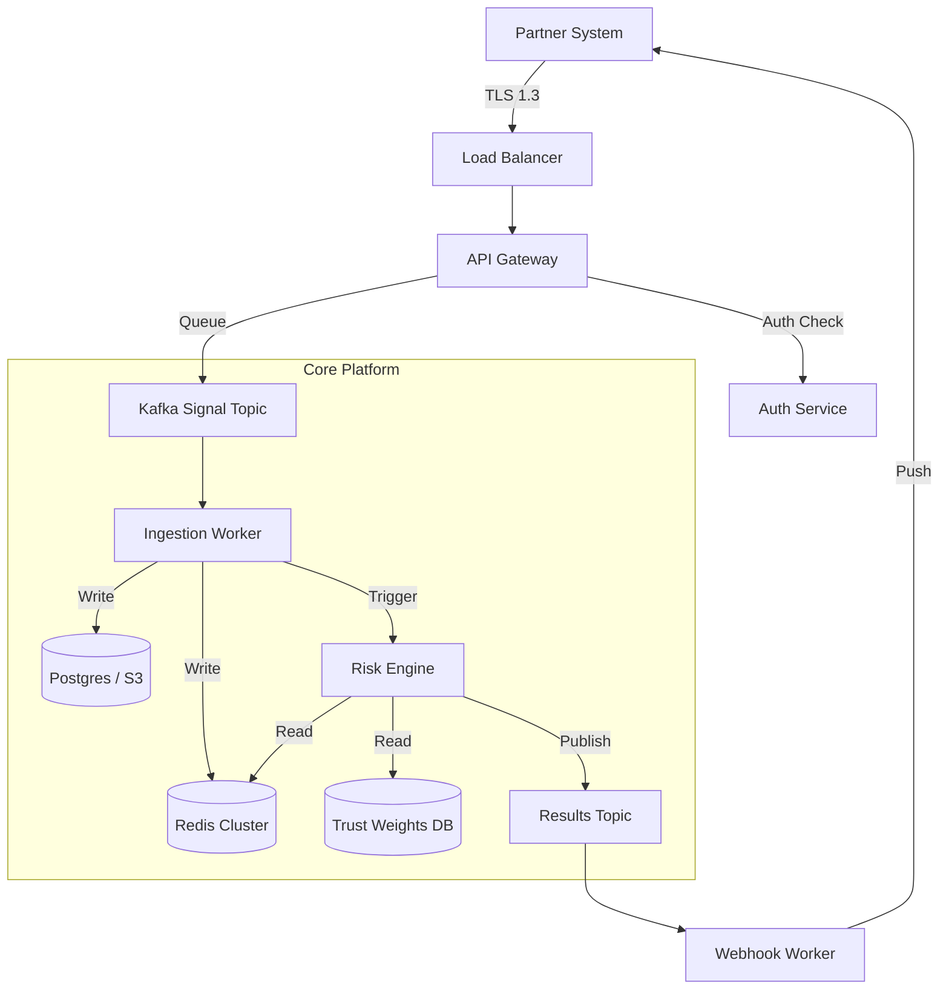

# System Diagrams

::callout{icon="i-lucide-lock" color="red"}
**RESTRICTED**: Internal Protegey team only. Do not share externally.
::

## High-Level Topology

## Critical Components

1.  **API Gateway**: Handles rate limiting, auth validation, and routing.
2.  **Risk Engine**: The stateless compute cluster that executes scoring logic.
3.  **TrustDB**: Stores partner reputation scores (updated nightly).
