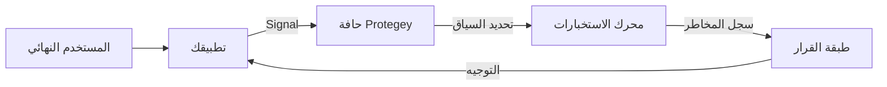

يعتمد Protegey على هندسة موزعة وقائمة على الأحداث، مصممة لمعالجة الإشارات عالية السرعة مع الحفاظ على الخصوصية والأمن. تعمل المنصة كطبقة ذكية بين تطبيقك والتهديدات المحتملة.

::alert{type="info"}
تمثل المخططات الهندسية أدناه تدفق البيانات عالي المستوى. تفاصيل التنفيذ محجوزة لتوثيق الشركاء.
::

## المكونات الأساسية

### 1. طبقة استيعاب الإشارات (Signal Ingestion Layer)

نقطة الدخول لجميع البيانات. تقبل هذه الطبقة ذات الإنتاجية العالية الإشارات من مجموعات أدوات تطوير البرمجيات (SDKs) وواجهات برمجة التطبيقات (APIs) وتكاملات الشركاء. تقوم بالتحقق من صحة البيانات وتوحيدها فوراً قبل توجيهها إلى محرك المعالجة.

- **شبكة الحافة العالمية (Global Edge Network)**: نقاط نهاية ذات زمن استجابة منخفض موزعة عالمياً.
- **معالجة التدفق (Stream Processing)**: استيعاب الأحداث في الوقت الفعلي عبر WebSocket و HTTP/2.
- **التحقق من الحمولة (Payload Validation)**: إنفاذ صارم للنموذج المطلوب (Schema) عند الحافة.

### 2. محرك الاستخبارات (Intelligence Engine)

قلب Protegey. يقوم هذا المحرك بربط الإشارات الجديدة بالبيانات التاريخية والأنماط العالمية لتقييم المخاطر.

- **التحليل السلوكي**: يتتبع أنماط رحلة المستخدم عبر الجلسات.
- **بصمة الجهاز (Device Fingerprinting)**: يحدد الأجهزة حتى بعد إعادة الضبط أو تغيير عنوان IP.
- **تأثيرات الشبكة**: يستفيد من استخبارات الشركاء المتعددة (دون مشاركة البيانات الخام).

### 3. طبقة القرار (Decision Layer)

حيث تتحول الاستخبارات إلى أفعال. تشمل الأمثلة على القرارات `BLOCK` (حظر)، أو `CHALLENGE` (تحدي/اختبار)، أو `ALLOW` (سماح).

- **محرك السياسات**: قواعد قابلة للتكوين خاصة بمنطق عملك.
- **التقييم بالذكاء الاصطناعي (ML Scoring)**: تقييم احتمالي للمخاطر (منخفض، متوسط، مرتفع، حرج).
- **تنظيم الاستجابة**: التوجيهات المرسلة مرة أخرى إلى تطبيقك.

### 4. طبقة عزل المستأجرين (Multi-Tenant Isolation Layer)

تضمن فصلاً كاملاً للبيانات بين الشركاء والبيئات المختلفة.

- **عزل المخططات في PostgreSQL**: فصل مادي باستخدام مخططات قاعدة البيانات (`sandbox` مقابل `public`).
- **التنفيذ الواعي للسياق**: يتتبع سياق التنفيذ غير القابل للتغيير البيئة وهوية الشريك.
- **الإنفاذ التلقائي للمخطط**: تقوم البرمجيات الوسيطة بضبط `search_path` لعزل الاستعلامات.
- **صفر تلوث تبادلي**: لا تؤثر إشارات بيئة التجارب (Sandbox) أبداً على سجلات مخاطر الإنتاج.

## هندسة تعدد المستأجرين (Multi-Tenant Architecture)

ينفذ Protegey **عزلاً مادياً للبيانات** على مستوى قاعدة البيانات لضمان الفصل الكامل بين الشركاء والبيئات.

### الفصل القائم على المخطط (Schema-Based Separation)

**هيكل قاعدة البيانات**:

```
قاعدة بيانات PostgreSQL
├── المخطط العام public (الإنتاج + البيانات المشتركة)
│   ├── signals (بيانات شركاء الإنتاج)
│   ├── fraud_entities (بيانات شركاء الإنتاج)
│   ├── fraud_cases (بيانات شركاء الإنتاج)
│   ├── users (مشترك بين جميع الشركاء)
│   ├── partners (مشترك بين جميع الشركاء)
│   └── subscriptions (بيانات الفوترة المشتركة)
│
└── مخطط sandbox (بيئة التجارب)
    ├── signals (بيانات شركاء Sandbox)
    ├── fraud_entities (بيانات شركاء Sandbox)
    ├── fraud_cases (بيانات شركاء Sandbox)
    └── [تكرار جميع الجداول الخاصة بالشركاء]
```

**الفوائد الرئيسية**:

- **عزل حقيقي**: بيانات Sandbox مفصولة مادياً عن الإنتاج.
- **إعادة ضبط سهلة**: مسح مخطط Sandbox دون التأثير على الإنتاج.
- **الأداء**: لا تؤثر استعلامات Sandbox على أداء الإنتاج.
- **الامتثال**: سجل تدقيق واضح لفصل البيانات.

### التنفيذ الواعي للسياق (Context-Aware Execution)

يتم تنفيذ كل عملية في Protegey ضمن **CentryContext** - وهو كائن غير قابل للتغيير يلخص:

- **البيئة**: `production` أو `sandbox`.
- **هوية الشريك**: معرف UUID الخاص بالشريك لتحديد النطاق.
- **تتبع الطلبات**: معرف طلب فريد للتتبع الموزع.
- **تحديد المخطط**: تحديد تلقائي لمخطط PostgreSQL الصحيح.

**تدفق التنفيذ**:

```
طلب HTTP ← تحديد السياق ← إنفاذ المخطط ← تنفيذ الاستعلام
                  ↓               ↓                 ↓
               (البيئة)    (ضبط search_path)  (المخطط الصحيح)
```

**الحفاظ على السياق**:

- طلبات HTTP: يتم تحديد السياق من الرؤوس (Headers) أو ملفات تعريف الارتباط أو معلمات الاستعلام.
- وظائف الطابور (Queue jobs): يتم التقاط السياق عند الإرسال واستعادته عند المعالجة.
- أوامر CLI: يتم ربط السياق بوضوح قبل العمليات.

يضمن ذلك **انعدام المخاطر** في الاستعلام عن البيئة الخاطئة أو بيانات شريك آخر عن طريق الخطأ.

## تدفق البيانات

### تدفق معالجة الإشارات



### تدفق طلبات تعدد المستأجرين

```
1. طلب واجهة برمجة التطبيقات للشريك
   ↓
2. تحديد السياق
   - اكتشاف البيئة (sandbox/production)
   - اكتشاف معرف الشريك UUID
   - إنشاء CentryContext
   ↓
3. إنفاذ المخطط
   - ضبط PostgreSQL search_path
   - sandbox ← SET search_path TO sandbox, public
   - production ← SET search_path TO public, public
   ↓
4. تنفيذ الاستعلام
   - جميع الاستعلامات تستخدم المخطط الصحيح تلقائياً
   - تطبيق نطاق معرف الشريك UUID
   ↓
5. الاستجابة
   - إرجاع البيانات للبيئة الصحيحة
   - الحفاظ على السياق للعمليات غير المتزامنة
```

## استراتيجية السحابة الهجينة (Hybrid Cloud Strategy)

يعمل Protegey وفق نموذج هجين لضمان سيادة البيانات والأداء.

| المكون                                | الموقع       | الغرض                           |
| ------------------------------------- | ------------ | ------------------------------- |
| مركز البيانات (Hub)                   | خاص بالمنطقة | الامتثال لموقع تخزين البيانات   |
| التحكم العالمي (Global Control Plane) | مركزي        | إدارة التكوين والسياسات         |
| عقد الحافة (Edge Nodes)               | موزعة        | اتخاذ القرار بزمن استجابة منخفض |

## نماذج التكامل

### متزامن (Blocking)

للتدفقات الحرجة مثل تسجيل الدخول أو إتمام الشراء. ينتظر تطبيقك قرار Protegey قبل المتابعة.
_تأثير زمن الاستجابة: ~50-100 مللي ثانية_

### غير متزامن (Non-Blocking)

لمراقبة التدفقات مثل مشاهدة الصفحات أو الإضافة إلى السلة. يعالج Protegey الإشارة ويخطرك عبر Webhook في حال اكتشاف مخاطر.
_تأثير زمن الاستجابة: شبه معدوم_
