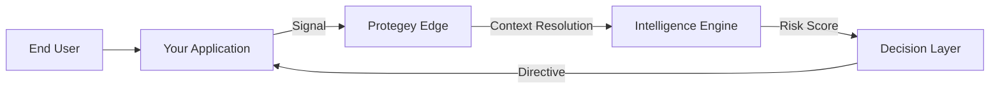

# Platform Architecture

Protegey is built on a distributed, event-driven architecture designed to process high-velocity signals while maintaining privacy and security. The platform operates as an intelligent layer between your application and potential threats.

::alert{type="info"}
The architecture diagrams below represent the high-level data flow. Implementation details are reserved for partner documentation.
::

## Core Components

### 1. The Signal Ingestion Layer
The entry point for all data. This high-throughput layer accepts signals from SDKs, APIs, and partner integrations. It performs immediate validation and normalization before routing data to the processing engine.

- **Global Edge Network**: Low-latency endpoints distributed worldwide
- **Stream Processing**: Real-time event ingestion via WebSocket and HTTP/2
- **Payload Validation**: Strict schema enforcement at the edge

### 2. The Intelligence Engine
The heart of Protegey. This engine correlates new signals with historical data and global patterns to assess risk.

- **Behavioral Analysis**: Tracks user journey patterns across sessions
- **Device Fingerprinting**: Identifies devices even after resets or IP changes
- **Network Effects**: Leverages cross-partner intelligence (without sharing raw data)

### 3. The Decision Layer
Where intelligence becomes action. Examples of decisions include `BLOCK`, `CHALLENGE`, or `ALLOW`.

- **Policy Engine**: Configurable rules specific to your business logic
- **ML Scoring**: Probabilistic risk assessment (LOW, MEDIUM, HIGH, CRITICAL)
- **Response Orchestration**: Directives sent back to your application

### 4. Multi-Tenant Isolation Layer
Ensures complete data separation between partners and environments.

- **PostgreSQL Schema Isolation**: Physical separation using database schemas (`sandbox` vs `public`)
- **Context-Aware Execution**: Immutable execution context tracks environment and partner identity
- **Automatic Schema Enforcement**: Middleware sets `search_path` for query isolation
- **Zero Cross-Contamination**: Sandbox signals never affect production risk scores

## Multi-Tenant Architecture

Protegey implements **physical data isolation** at the database level to ensure complete separation between partners and environments.

### Schema-Based Separation

**Database Structure**:
```
PostgreSQL Database
├── public schema (Production + Shared Data)
│   ├── signals (production partner data)
│   ├── fraud_entities (production partner data)
│   ├── fraud_cases (production partner data)
│   ├── users (shared across all partners)
│   ├── partners (shared across all partners)
│   └── subscriptions (shared billing data)
│
└── sandbox schema (Sandbox Environment)
    ├── signals (sandbox partner data)
    ├── fraud_entities (sandbox partner data)
    ├── fraud_cases (sandbox partner data)
    └── [all partner-scoped tables duplicated]
```

**Key Benefits**:
- **True Isolation**: Sandbox data physically separated from production
- **Easy Reset**: Truncate sandbox schema without affecting production
- **Performance**: Sandbox queries don't impact production performance
- **Compliance**: Clear audit trail of data segregation

### Context-Aware Execution

Every operation in Protegey executes within a **CentryContext** - an immutable object that encapsulates:

- **Environment**: `production` or `sandbox`
- **Partner Identity**: Partner UUID for multi-tenant scoping
- **Request Tracking**: Unique request ID for distributed tracing
- **Schema Resolution**: Automatic determination of correct PostgreSQL schema

**Execution Flow**:
```
HTTP Request → Resolve Context → Enforce Schema → Execute Query
                    ↓                 ↓                ↓
              (environment)   (SET search_path)   (correct schema)
```

**Context Preservation**:
- HTTP requests: Context resolved from headers, cookies, query params, or domain
- Queue jobs: Context captured at dispatch time, restored in worker
- CLI commands: Context explicitly bound before operations

This ensures **zero risk** of accidentally querying the wrong environment or partner's data.

## Data Flow

### Signal Processing Flow



### Multi-Tenant Request Flow

```
1. Partner API Request
   ↓
2. Context Resolution
   - Detect environment (sandbox/production)
   - Detect partner UUID
   - Create CentryContext
   ↓
3. Schema Enforcement
   - Set PostgreSQL search_path
   - sandbox → SET search_path TO sandbox, public
   - production → SET search_path TO public, public
   ↓
4. Query Execution
   - All queries use correct schema automatically
   - Partner UUID scoping applied
   ↓
5. Response
   - Data returned for correct environment
   - Context preserved for async operations
```

## Hybrid Cloud Strategy

Protegey operates on a hybrid model to ensure data sovereignty and performance.

| Component | Location | Purpose |
|ort | Region-Specific | Data Residency Compliance |
| Global Control Plane | Centralized | Configuration & Policy Management |
| Edge Nodes | Distributed | Low-latency Decisioning |

## Integration Models

### Synchronous (Blocking)
For critical flows like Login or Checkout. Your app waits for Protegey's decision before proceeding.
*Latency Impact: ~50-100ms*

### Asynchronous (Non-Blocking)
For monitoring flows like Page Views or Add to Cart. Protegey processes the signal and notifies you via webhook if risks are detected.
*Latency Impact: Near Zero*
