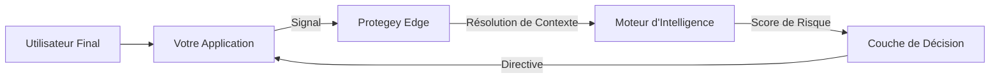

Protegey repose sur une architecture distribuée et pilotée par les événements, conçue pour traiter des signaux à haute vélocité tout en garantissant la confidentialité et la sécurité. La plateforme opère comme une couche intelligente entre votre application et les menaces potentielles.

::alert{type="info"}
Les diagrammes d'architecture ci-dessous représentent le flux de données de haut niveau. Les détails de mise en œuvre sont réservés à la documentation des partenaires.
::

## Modèle API à Trois Couches

Protegey expose trois points d'accès correspondant à des étapes distinctes du cycle de vie de l'intelligence anti-fraude :

```
Données Brutes → POST /evaluate → (resolve_entity: true) → Entité → POST /risk/assess
                      ↓ sans état                                          ↓ avec état
                 Verdict immédiat                               Package d'intelligence complet
                                      ↑
                          POST /signals (ingestion)
                          alimente le graphe d'entités dans le temps
```

| Couche | Point d'accès | Type | Objectif |
|---|---|---|---|
| Ingestion | `POST /signals` | Avec état | Alimenter le graphe d'entités avec des événements comportementaux |
| Évaluation | `POST /evaluate` | Sans état | Évaluer des identifiants bruts en < 100ms |
| Évaluation complète | `POST /risk/assess` | Avec état | Package d'intelligence d'entité complet en < 500ms |

Consultez le [Modèle d'Intelligence](/partners/api-reference/api-intelligence-model) pour savoir quel point d'accès utiliser.

---

## Composants Principaux

### 1. La Couche d'Ingestion des Signaux

Le point d'entrée de toutes les données. Cette couche à haut débit accepte les signaux provenant des SDK, des API et des intégrations partenaires. Elle effectue une validation et une normalisation immédiates avant de router les données vers le moteur de traitement.

- **Réseau Edge Mondial** : Points de terminaison à faible latence répartis dans le monde entier.
- **Traitement par Flux** : Ingestion d'événements en temps réel via WebSocket et HTTP/2.
- **Validation du Payload** : Application stricte du schéma au niveau de l'edge.

### 2. Le Moteur d'Intelligence

Le cœur de Protegey. Ce moteur corrèle les nouveaux signaux avec les données historiques et les schémas mondiaux pour évaluer le risque.

- **Analyse Comportementale** : Suit les schémas du parcours utilisateur à travers les sessions.
- **Empreinte Numérique des Appareils** : Identifie les appareils même après une réinitialisation ou un changement d'IP.
- **Effets de Réseau** : Tire parti de l'intelligence inter-partenaires (sans partager de données brutes).

### 3. La Couche de Décision

Là où l'intelligence devient action. Les exemples de décisions incluent `BLOCK` (bloquer), `CHALLENGE` (vérifier) ou `ALLOW` (autoriser).

- **Moteur de Politiques** : Règles configurables spécifiques à votre logique métier.
- **Scoring ML** : Évaluation du risque probabiliste (BAS, MOYEN, ÉLEVÉ, CRITIQUE).
- **Orchestration des Réponses** : Directives renvoyées à votre application.

### 4. Couche d'Isolation Multi-Locataire

Garantit une séparation complète des données entre les partenaires et les environnements.

- **Isolation des schémas PostgreSQL** : Séparation physique à l'aide de schémas de base de données (`sandbox` vs `public`).
- **Exécution Sensible au Contexte** : Le contexte d'exécution immuable suit l'environnement et l'identité du partenaire.
- **Application Automatique du Schéma** : Le middleware définit le `search_path` pour l'isolation des requêtes.
- **Zéro Contamination Croisée** : Les signaux du sandbox n'affectent jamais les scores de risque en production.

## Architecture Multi-Locataire

Protegey met en œuvre une **isolation physique des données** au niveau de la base de données pour garantir une séparation complète entre les partenaires et les environnements.

## Parcours d'Accès Partenaire

Protegey utilise un modèle d'onboarding progressif qui privilégie un accès rapide au sandbox tout en gardant la production protégée par une validation.

### Premier Accès (Sandbox d'abord)

1. Le partenaire réinitialise son mot de passe et se connecte pour la première fois.
2. Le partenaire voit une courte introduction non bloquante (visite guidée, limites du sandbox, liens de support). Cette introduction ne collecte pas de données d'onboarding et sert uniquement à vérifier des informations de base.
3. L'accès au sandbox est accordé immédiatement.

### Accès à la Production (Contrôlé)

Lorsqu'un partenaire demande l'accès à la production, il complète le processus d'onboarding complet (conformité, identité, facturation et validation technique). L'accès à la production n'est accordé qu'après approbation.

### Accès Sandbox vs Production

- **Moment d'accès** : L'accès au sandbox est accordé immédiatement après la première connexion ; l'accès à la production est accordé uniquement après l'approbation de l'onboarding.
- **Exigences** : Le sandbox nécessite une courte introduction ; la production exige conformité, identité, facturation et validation technique.
- **Objectif** : Le sandbox sert à explorer et intégrer ; la production sert au trafic réel et au suivi opérationnel.

**Pourquoi ce modèle** :

- **Activation plus rapide** : Les partenaires peuvent explorer et intégrer immédiatement.
- **Séparation claire** : Le sandbox et la production restent isolés par schéma et politique.
- **Risque maîtrisé** : L'accès à la production reste gouverné par les contrôles d'onboarding.

### Séparation basée sur les schémas

**Structure de la base de données** :

```
Base de données PostgreSQL
├── schéma public (Production + Données partagées)
│   ├── signals (données des partenaires en production)
│   ├── fraud_entities (données des partenaires en production)
│   ├── fraud_cases (données des partenaires en production)
│   ├── users (partagés entre tous les partenaires)
│   ├── partners (partagés entre tous les partenaires)
│   └── subscriptions (données de facturation partagées)
│
└── schéma sandbox (Environnement Sandbox)
    ├── signals (données des partenaires en sandbox)
    ├── fraud_entities (données des partenaires en sandbox)
    ├── fraud_cases (données des partenaires en sandbox)
    └── [toutes les tables à portée partenaire dupliquées]
```

**Avantages Clés** :

- **Véritable Isolation** : Données sandbox physiquement séparées de la production.
- **Réinitialisation Facile** : Tronquer le schéma sandbox sans affecter la production.
- **Performance** : Les requêtes sandbox n'impactent pas les performances de la production.
- **Conformité** : Piste d'audit claire de la ségrégation des données.

### Exécution Sensible au Contexte

Chaque opération dans Protegey s'exécute au sein d'un **CentryContext** - un objet immuable qui encapsule :

- **Environnement** : `production` ou `sandbox`.
- **Identité du Partenaire** : UUID du partenaire pour le cadrage multi-locataire.
- **Suivi des requêtes** : ID de requête unique pour le traçage distribué.
- **Résolution de Schéma** : Détermination automatique du schéma PostgreSQL correct.

**Flux d'exécution** :

```
Requête HTTP → Résoudre le Contexte → Appliquer le Schéma → Exécuter la Requête
                     ↓                     ↓                    ↓
               (environnement)       (SET search_path)     (schéma correct)
```

**Préservation du Contexte** :

- Requêtes HTTP : Contexte résolu à partir des en-têtes, des cookies, des paramètres de requête ou du domaine.
- Tâches de file d'attente : Contexte capturé au moment de l'envoi, restauré chez le worker.
- Commandes CLI : Contexte explicitement lié avant les opérations.

Cela garantit un **risque zéro** de requêter accidentellement le mauvais environnement ou les données d'un autre partenaire.

## Flux de Données

### Flux de Traitement des Signaux



### Flux de Requête Multi-Locataire

```
1. Requête API du Partenaire
   ↓
2. Résolution du Contexte
   - Détecter l'environnement (sandbox/production)
   - Détecter l'UUID du partenaire
   - Créer le CentryContext
   ↓
3. Application du Schéma
   - Définir le search_path PostgreSQL
   - sandbox → SET search_path TO sandbox, public
   - production → SET search_path TO public, public
   ↓
4. Exécution de la Requête
   - Toutes les requêtes utilisent le schéma correct automatiquement
   - Cadrage de l'UUID du partenaire appliqué
   ↓
5. Réponse
   - Données renvoyées pour le bon environnement
   - Contexte préservé pour les opérations asynchrones
```

## Stratégie de Cloud Hybride

Protegey fonctionne sur un modèle hybride pour garantir la souveraineté des données et la performance.

| Composant                | Emplacement            | Objectif                                      |
| ------------------------ | ---------------------- | --------------------------------------------- |
| Hub de Données           | Spécifique à la région | Conformité de la résidence des données        |
| Plan de Contrôle Mondial | Centralisé             | Gestion de la configuration et des politiques |
| Nœuds Edge               | Distribués             | Prise de décision à faible latence            |

## Modèles d'Intégration

### Synchrone (Bloquant)

Pour les flux critiques comme la Connexion ou le Paiement. Votre application attend la décision de Protegey avant de continuer.
_Impact sur la latence : ~50-100ms_

### Asynchrone (Non-Bloquant)

Pour surveiller des flux comme les vues de pages ou l'ajout au panier. Protegey traite le signal et vous informe via webhook si des risques sont détectés.
_Impact sur la latence : Presque nul_

## Phase M : Couche de monitoring

La couche de monitoring fournit deux endpoints de santé :

- **`/ready`** — sonde de vivacité pour les équilibreurs de charge. Vérifie uniquement la connectivité à la base de données. Cible : < 100 ms.
- **`/health`** — vérification approfondie couvrant la base de données, Redis, les workers de file d'attente, le WebSocket Reverb, le cache graphique et l'ingestion OSINT. Réponse mise en cache 30 secondes.

La surveillance des files d'attente est disponible dans le panneau d'administration avec des statistiques par file, la gestion des tâches échouées et les outils de relance.

## Domaine du module Support

Le domaine `Support` (`app/Domain/Support/`) gère la messagerie intégrée à la plateforme entre les partenaires et l'équipe Protegey. Il s'intègre avec Laravel Reverb pour la livraison de messages en temps réel et stocke les fils, messages et pièces jointes avec un contrôle d'accès limité au périmètre partenaire.

## Couche d'intelligence graphique

La couche de graphe chaud (PostgreSQL `graph_nodes` + `graph_edges`, cache d'adjacence Redis) cartographie les relations entre entités et propage le risque dans les réseaux en temps réel. Le `network_score` du graphe contribue à 40 % du score de risque final fusionné. La traversée BFS jusqu'à la profondeur 2 s'effectue en < 5 ms sur le cache Redis.
